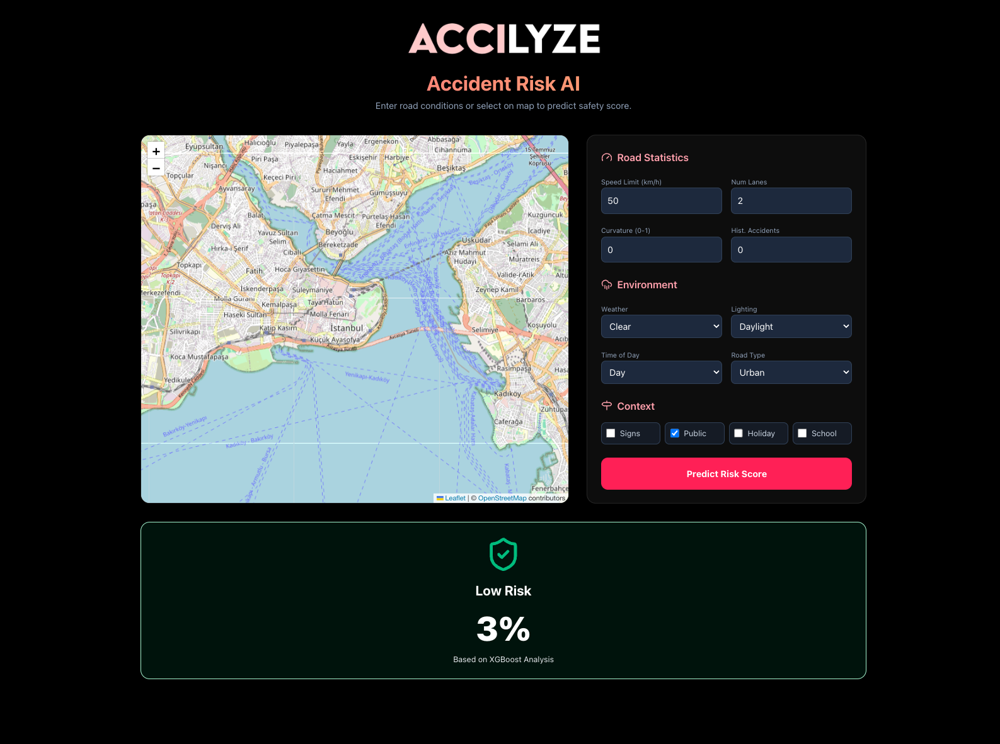

# Accilyze: Accident Risk Prediction AI

<center>
    
</center>

> **Note:** This project was developed as an assignment for the **Machine Learning** course at **Istanbul University, Department of Computer Science**.

This application is an interface developed for the **XGBoost** model, which was selected as the final model trained on the **Kaggle** dataset **[Predicting Road Accident Risk (Playground Series - Season 5, Episode 10)](https://www.kaggle.com/competitions/playground-series-s5e10)**. It predicts road accident risk in real-time by combining a **Next.js** frontend with a **FastAPI** backend.

## Features

-   **Interactive Map**: Click anywhere on the map to automatically fetch real-world road data (speed limit, lanes, and curvature) using the Overpass API.
-   **Real-time Risk Analysis**: Instant risk scoring (Low, Medium, High) based on road characteristics and environmental factors.
-   **Advanced Geometry**: Frontend algorithms calculate road curvature dynamically from OpenStreetMap vector data.
-   **Modern UI**: A beautiful, responsive dark-mode interface built with Tailwind CSS, Framer Motion, and Glassmorphism effects.

## Tech Stack

-   **Frontend**: Next.js 16.1.1, TypeScript, Tailwind CSS, Leaflet (React-Leaflet), Framer Motion.
-   **Backend**: Python, FastAPI, Pandas, Joblib.
-   **ML Model**: XGBoost Regressor.
-   **Infrastructure**: Docker, Docker Compose.

## Setup & Usage

### Prerequisites

-   Docker & Docker Compose
-   Node.js & npm (for local development)
-   Python 3 (for local development)

### Configuration

1.  **Create the environment file:**
    ```bash
    cp example.env .env
    ```
2.  **Update configurations:**
    Open `.env` and adjust the values if necessary (e.g., API URLs).

### Installation (Docker)

1.  **Clone the repository:**
    ```bash
    git clone https://github.com/enesbuyuk/accilyze.git
    cd accilyze
    ```

2.  **Run with Docker Compose:**
    ```bash
    docker compose up --build
    ```

    This will start both the frontend and backend services.

3.  **Access the App:**
    -   **Frontend**: [http://localhost:3000](http://localhost:3000)
    -   **Backend API**: [http://localhost:8000](http://localhost:8000)

### Local Development (Manual Setup)

If you prefer to run the project without Docker, you can use the provided `make` commands.

1.  **Install Dependencies:**
    ```bash
    make local-install
    ```
    This command creates a Python virtual environment, installs backend dependencies, and installs frontend node modules.

2.  **Start Services:**
    ```bash
    make local-start
    ```
    This runs both the backend and frontend services in parallel.

    **Alternative commands:**
    -   `make start-backend`: Starts only the FastAPI backend.
    -   `make start-frontend`: Starts only the Next.js frontend.

## Project Structure

```
├── web_app/
│   ├── frontend/       # Next.js Source Code
│   └── backend/        # FastAPI App & Model
├── notebooks/          # Jupyter Notebooks for Training
├── compose.yml         # Container Orchestration
└── README.md           # Project Documentation
```

## Preview


### Demo Photos



### Demo Website

You can try the app out at [https://accilyze.iucs.net](https://accilyze.iucs.net).

## License

GPL-3.0